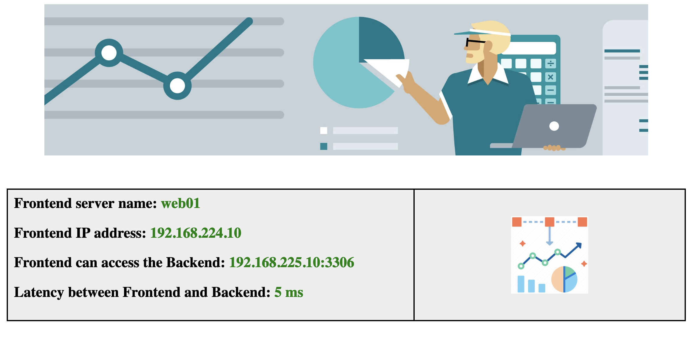

# 2-tier-app
Simulate a simple 2-tier application with a NGINX + PHP frontend and a MySQL backend. Both frontend and backend are Docker Compose container applications. The frontend's web page is stored externally to the nginx container which makes it easy to modify on the fly.



## Preparations
Prepare one or two Ubuntu 22.04 machines depending on if you want the backend component to run on its own machine:

* ```sudo apt update && sudo apt install git docker-compose```
* ```git clone https://github.com/rutgerblom/2-tier-app.git ~/git/2-tier-app```
* ```chmod +x ~/git/2-tier-app/frontend/up.sh```
* ```chmod +x ~/git/2-tier-app/frontend/down.sh```
* ```chmod +x ~/git/2-tier-app/backend/up.sh```
* ```chmod +x ~/git/2-tier-app/backend/down.sh```

## Usage
### Frontend Component
Modify the values for ```$host``` and ```$port``` in the ```frontend/src/index.php``` file so that these match the IP address and port number of your backend.

To start the frontend:

```sudo ~/git/2-tier-app/frontend/up.sh```

To stop the frontend:

```sudo ~/git/2-tier-app/frontend/down.sh```

### Backend Component
Depending on your use case, the included backend component can run on the same or a different machine.

To start the backend:
 
```sudo ~/git/2-tier-app/backend/up.sh```

To stop the backend:

```sudo ~/git/2-tier-app/backend/down.sh```